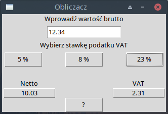

# Obliczacz VAT

Prosty kalkulator kwoty netto i podatku VAT na podstawie kwoty brutto.  
Aplikacja powstała z myślą o mojej Mamie – księgowej, która często potrzebowała szybkiego sposobu na obliczenia, bez sięgania po kalkulator czy arkusz kalkulacyjny.

---

## 🧾 Dlaczego powstał?

Gdzieś w okolicach 2016–2017 roku zauważyłem, że Mama bardzo często robi te same działania „z głowy” albo z kalkulatorem w ręce. Postanowiłem więc stworzyć coś prostego, co ułatwi jej codzienną pracę – aplikację, która będzie „tylko do tego” i będzie gotowa w kilka sekund po uruchomieniu.

To była jedna z moich pierwszych graficznych aplikacji użytkowych.

---

## 📌 Jak to działa?

- Wprowadzasz kwotę brutto
- Wybierasz jedną ze stawek VAT (5%, 8% lub 23%)
- Program automatycznie wylicza kwotę netto i podatek VAT

---

## 🖼️ Zrzut ekranu

---

## ⚠️ Uwaga techniczna

Dziś, po latach, zauważyłem drobny błąd:  
Aplikacja nie radzi sobie z przecinkiem jako separatorem dziesiętnym (np. `123,45` zamiast `123.45`). Wpisanie liczby z przecinkiem może spowodować błąd.  
W tamtym czasie nie zwróciłem na to uwagi — Mama korzystała tylko z klawiatury numerycznej z kropką i wszystko działało bez problemu.

Zostawiam to bez poprawek. Taki był ten program.  
I taki niech zostanie.

---

## 🕊️ Dla kogo?

Dla Mamy.  
Dziś, gdy jej już nie ma — dla mnie.  
I może też dla Ciebie, jeśli szukasz czegoś bardzo prostego, bez reklam, bez zbędnych opcji.  
Czasem kod, który robi tylko jedną rzecz — robi najwięcej.

---

## ℹ️ Uwaga

Stawki VAT zakodowane w programie (5%, 8%, 23%) były aktualne w czasie jego powstawania.  
Jeśli chcesz używać tej aplikacji dzisiaj — **upewnij się, że odpowiadają aktualnym przepisom** lub dostosuj kod do własnych potrzeb.

Kod objęty licencją MIT (pl. „rób, co chcesz — na własną odpowiedzialność” 😉).

---

> "Nie jestem programistą z zawodu. Jestem nim z powołania."
